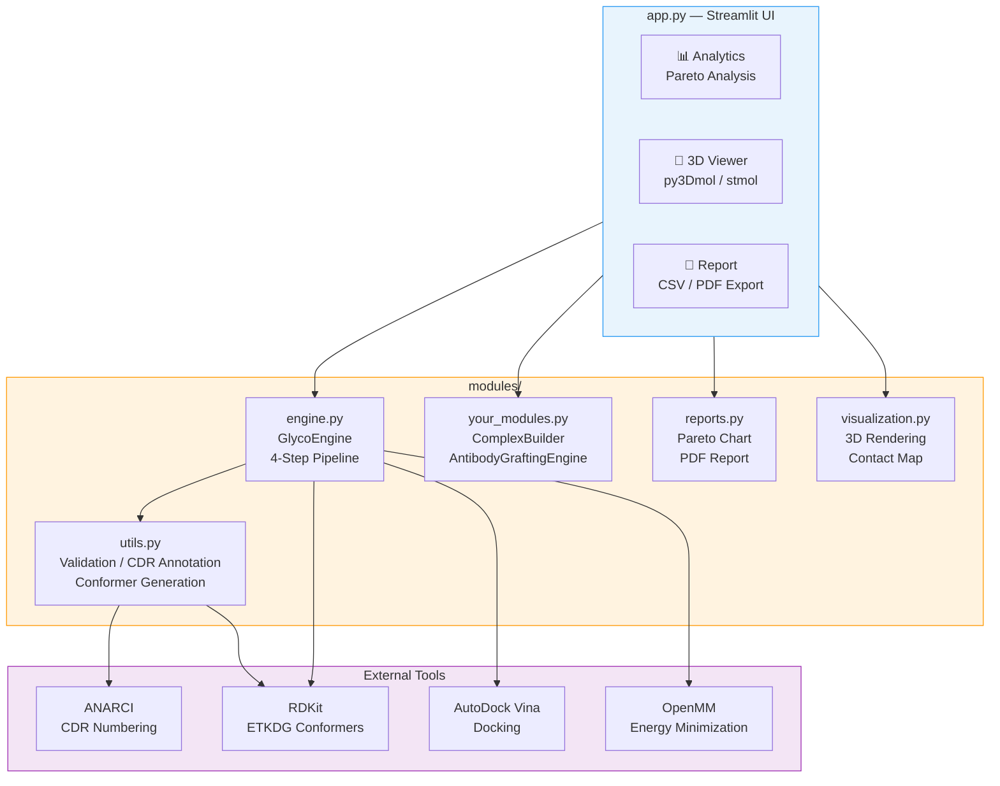

# 🧪 GlycoAntibody Studio

**糖鎖抗原ターゲット抗体の計算設計プラットフォーム**

癌関連糖鎖抗原（TACA）などの糖鎖を標的とした抗体を自動設計・シミュレーションするための統合計算ツールです。トラスツズマブ（Trastuzumab）の安定したフレームワークを基盤とし、CDR移植からドッキング、多目的最適化による候補選択までを一気通貫で実行します。

---

## 🚀 Quick Start

```bash
# 1. リポジトリのクローン
git clone https://github.com/TSUBAKI0531/GlycoAntibodyStudio.git
cd GlycoAntibodyStudio

# 2. 依存ライブラリのインストール
pip install -r requirements.txt
conda install -c conda-forge openmm pdbfixer   # 構造最適化（任意）
conda install -c bioconda anarci               # 抗体ナンバリング（任意）

# 3. アプリの起動
streamlit run app.py
```

サイドバーに糖鎖の SMILES を入力し、`sample_candidates.csv` をアップロードすれば解析を開始できます。

---

## 🏗 Architecture



### パイプライン概要

```
入力: 糖鎖 SMILES + CDR3 候補リスト (CSV)
  │
  ├─ Step 1: CDR Grafting ─── IMGT/Chothia/Kabat 対応、indels 処理
  ├─ Step 2: Structure Opt ── OpenMM AMBER14 力場エネルギー最小化
  ├─ Step 3: Docking ──────── 保存水 + 糖鎖アンサンブル × AutoDock Vina
  └─ Step 4: Scoring ──────── H結合重み付け + 脱水和コスト補正
  │
出力: パレート最適候補 + 3D構造 + PDF レポート
```

---

## 📂 Project Structure

```
GlycoAntibodyStudio/
├── app.py                  # Streamlit メインアプリ（371行）
├── your_modules.py         # 3D構造生成 & CDR移植エンジン（406行）
├── modules/
│   ├── __init__.py
│   ├── engine.py           # 計算パイプライン本体（434行）
│   ├── utils.py            # バリデーション・配列解析・PDB取得（387行）
│   ├── reports.py          # パレート図・PDFレポート生成（432行）
│   └── visualization.py    # 3D分子ビューア・コンタクトマップ（287行）
├── requirements.txt
├── packages.txt            # conda 用システムパッケージ
├── sample_candidates.csv   # テスト用 CDR3 候補 10 配列
├── .gitignore
└── LICENSE
```

---

## 🔬 科学的背景

### なぜ糖鎖抗体の設計は難しいのか

糖鎖はタンパク質と異なり、高度な柔軟性（Conformational Flexibility）と複雑な水和シェルを持ちます。そのため抗体による特異的認識の難易度が高く、従来の単一構造ベースのドッキングでは不十分です。

本アプリでは、以下の3つの科学的アプローチでこの課題に対処しています。

### 1. 糖鎖コンフォメーション多様性（Ensemble Approach）

糖鎖は溶液中で複数の立体配座を取り得ます。RDKit の ETKDG v3 法により糖鎖アンサンブル（デフォルト20コンフォーマー）を生成し、多様な配座に対してドッキングを行うことで、真の結合ポーズの捕捉率を向上させています。

### 2. 保存水（Conserved Waters）による架橋作用

糖鎖表面は水酸基（-OH）が豊富であり、抗体との結合界面には水分子が介在します。高分解能PDB構造から同定された保存水を受容体の一部として保持したままドッキングを行い、水分子を介した水素結合ネットワークを考慮しています。

### 3. スコアリング補正（Scoring Calibration）

AutoDock Vina のスコアを以下の2点で補正しています：
- **H結合の重み付け強化**：糖鎖結合において支配的な水素結合の寄与を増幅
- **脱水和コストの再評価**：水溶液中からポケットへ移動する際のエネルギーペナルティを物理化学的パラメータに基づいて補正

---

## ✨ 主な機能

| 機能 | 説明 | 関連モジュール |
|------|------|---------------|
| **CDR Grafting** | IMGT番号付けに基づくCDR移植。ループ長変化（indels）対応 | `engine.py`, `your_modules.py` |
| **Structural Optimization** | OpenMM AMBER14力場によるエネルギー最小化 | `engine.py` |
| **Hydrated Ensemble Docking** | 保存水 + 糖鎖アンサンブル × AutoDock Vina | `engine.py` |
| **Pareto Analysis** | 結合親和性 vs. 疎水性のトレードオフ可視化 | `app.py`, `reports.py` |
| **3D Viewer** | CDR領域ハイライト付きインタラクティブ分子ビューア | `visualization.py` |
| **PDF Report** | サマリー・パレート図・ランキング表を含む自動レポート | `reports.py` |

---

## 🛠 設計方針

### 段階的フォールバック（Graceful Degradation）

ウェットラボの研究者が使うことを想定し、重い依存ライブラリが未インストールでもアプリが起動・動作するよう設計しています。

```
3D表示:    stmol → py3Dmol HTML埋め込み → テキスト表示
構造構築:  OpenMM + PDBFixer → プレースホルダーPDB生成
ドッキング: AutoDock Vina → 物理化学的シミュレーションスコア
CDR注釈:   ANARCI → 位置ベースフォールバック
SMILES検証: RDKit Mol変換 → 正規表現ベース検証
```

### モジュール分離

| レイヤー | 責務 |
|----------|------|
| `app.py` | UI・ユーザーインタラクション |
| `engine.py` | 計算パイプラインのオーケストレーション |
| `utils.py` | 入力バリデーション・共通ユーティリティ |
| `reports.py` | 出力・レポート生成 |
| `visualization.py` | 3D描画・チャート表示 |

### 型安全性

CDR配列やドッキング結果を `@dataclass` で定義し、リスト操作による順序取り違えを構造的に防止しています。

---

## 📈 ワークフロー

```
1. Input    糖鎖 SMILES とCDR3候補リスト（CSV）をサイドバーから入力
            ↓
2. Analysis CDR移植 → 構造最適化 → ドッキング → スコア補正をバッチ処理
            ↓
3. Selection パレート図でAffinity × Hydrophobicityのバランスを評価
            ↓
4. Export    3D構造の確認、CSV / PDFレポートのダウンロード
```

---

## ⚠️ Limitations

- **ドッキングスコアの精度**：AutoDock Vina はエントロピー項を明示的に含まず、溶媒効果も近似的です。本ツールのスコアは相対比較には有用ですが、絶対的な結合自由エネルギーの予測には限界があります。
- **構造モデリング**：CDR3ループのde novoモデリングは未実装です。現在はトラスツズマブの結晶構造をテンプレートとした相同モデリングに依存しています。
- **CDR予測**：現時点ではテンプレートベースの予測であり、配列-構造相関に基づく機械学習モデルは統合されていません。
- **実験的検証**：計算による予測結果はin vitroでの検証（SPR、ELISA等）が必須です。

---

## 📅 Roadmap

- [ ] 深層学習によるCDR配列自動生成エンジンの統合（AbLang / IgFold）
- [ ] 分子動力学シミュレーションによる結合自由エネルギーの精密評価（TI / FEP法）
- [ ] ESMFold / AlphaFold2 を用いたCDR3ループの de novo 構造予測
- [ ] Streamlit Cloud へのデプロイ対応
- [ ] Docker / Singularity コンテナの提供

---

## 📚 References

- Carter P, et al. (1992) Humanization of an anti-p185HER2 antibody for human cancer therapy. *PNAS* 89:4285-4289
- Lefranc MP, et al. (2003) IMGT unique numbering for immunoglobulin and T cell receptor variable domains. *Dev Comp Immunol* 27:55-77
- Trott O, Olson AJ (2010) AutoDock Vina: Improving the speed and accuracy of docking. *J Comput Chem* 31:455-461
- Riniker S, Landrum GA (2015) Better informed distance geometry: Using what we know to improve conformation generation. *J Chem Inf Model* 55:2562-2574

---

## 📝 License

This project is licensed under the MIT License - see the [LICENSE](LICENSE) file for details.

---

## 👤 Author

**Masaki Sukeda (助田 将樹)**
- Ph.D. in Agriculture
- Research Scientist — Antibody Drug Development
- GitHub: [@TSUBAKI0531](https://github.com/TSUBAKI0531)
