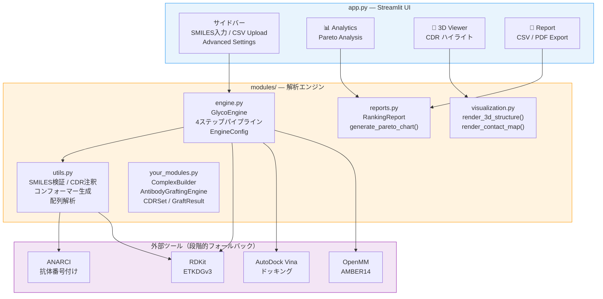

# GlycoAntibody Studio

糖鎖抗原ターゲット抗体のCDR設計・アンサンブルドッキング・多目的最適化を一気通貫で行うローカル実行型Streamlitアプリ。

> **ローカル実行版（フル機能）** — stmol / AutoDock Vina / OpenMM などStreamlit Cloud非対応の重量ライブラリを使用しています。
> クラウド実行版（軽量版）は [GlycoAntibodyStudio-cloud](https://github.com/TSUBAKI0531/GlycoAntibodyStudio-cloud) を参照してください。

---

## 解決した課題

癌関連糖鎖抗原（TACA）を標的とした抗体の計算設計は、糖鎖の高い構造柔軟性と複雑な水和シェルのために難易度が高く、CDR移植・構造最適化・ドッキング・候補選定を別々のツールで行う必要があった。本ツールは糖鎖のSMILESとCDR3候補リスト（CSV）を入力するだけで、CDR移植→構造最適化→保存水付きアンサンブルドッキング→パレート最適化まで全工程をStreamlit UIで完結させる。実験系研究者がコードを書かずに候補配列を比較できるよう設計している。

---

## 主要機能

- **CDR Grafting** — IMGT/Chothia/Kabat 番号付けに基づくトラスツズマブFRへのCDR-H3移植。ループ長変化（indels）に対応。
- **Hydrated Ensemble Docking** — RDKit ETKDGv3で生成した糖鎖コンフォーマーアンサンブル × 保存水を考慮した受容体構造に対しAutoDock Vinaを実行。
- **Scoring Calibration** — H結合重み付け強化と脱水和コスト補正でVinaスコアを糖鎖結合に適した値に再調整。
- **Pareto Analysis** — 結合親和性（calibrated score）× 疎水性のトレードオフを多目的最適化で可視化。パレート最適候補を星マークでハイライト。
- **3D Viewer & PDF Report** — CDR領域ハイライト付きインタラクティブ3D分子ビューアと、パレート図・ランキング表を含む自動PDFレポートのダウンロード。

---

## 技術スタック

| カテゴリ | 使用技術 |
|---|---|
| 分子モデリング | RDKit（ETKDGv3 コンフォーマー生成・SMILES検証）、AutoDock Vina + Meeko（ドッキング）、OpenMM AMBER14 + PDBFixer（構造最適化） |
| 抗体工学 | ANARCI（IMGT/Chothia/Kabat 番号付け）、BioPython ProteinAnalysis（疎水性・等電点・分子量） |
| 可視化 | Plotly（パレート図・インタラクティブ散布図）、py3Dmol / stmol（3D分子ビューア）、Matplotlib（PDF埋め込み用チャート） |
| レポート出力 | fpdf2（PDFレポート）、xlsxwriter（Excelエクスポート） |
| UI / データ | Streamlit（session_state管理・プログレスバー・タブレイアウト）、pandas / numpy |
| インフラ | **ローカル実行専用**（stmol・AutoDock Vina等のCloud非対応ライブラリを含む） |

---

## アーキテクチャ



### パイプラインフロー

```
入力: 糖鎖 SMILES + CDR3 候補リスト (CSV)
  │
  ├─ Step 1: CDR Grafting ─── IMGT番号付けでトラスツズマブFRに移植
  ├─ Step 2: Structure Opt ── OpenMM AMBER14 力場エネルギー最小化
  ├─ Step 3: Ensemble Docking ─ 保存水 + 糖鎖アンサンブル × AutoDock Vina
  └─ Step 4: Scoring Calibration ─ H結合重み付け + 脱水和コスト補正
  │
出力: パレート最適候補 + 3D構造 + PDF レポート
```

### ファイル別役割

| ファイル | 役割 |
|---|---|
| `app.py` | UI・ユーザーインタラクション・session_state管理・パレートフロント計算 |
| `modules/engine.py` | `GlycoEngine`（4ステップパイプライン）、`EngineConfig`、`DockingResult`・`PipelineResult` dataclass |
| `modules/utils.py` | SMILES検証（RDKit→正規表現フォールバック）、CSV解析、CDR注釈（ANARCI）、糖鎖コンフォーマー生成、配列解析 |
| `modules/reports.py` | Plotly/Matplotlibパレート図、`RankingReport`（fpdf2 PDF→テキストフォールバック） |
| `modules/visualization.py` | `render_3d_structure()`（stmol→py3Dmol HTML→テキスト）、`render_contact_map()` |
| `your_modules.py` | `ComplexBuilder`（ビジュアライゼーション用αヘリックス近似PDB生成）、`AntibodyGraftingEngine`（CDR移植エンジン）、`CDRSet`・`GraftResult` dataclass |

---

## 使用方法

### セットアップ

```bash
# 1. リポジトリのクローン
git clone https://github.com/TSUBAKI0531/GlycoAntibodyStudio.git
cd GlycoAntibodyStudio

# 2. 依存ライブラリのインストール
pip install -r requirements.txt

# 3. 重量依存ライブラリ（任意 — 未インストール時はフォールバック動作）
conda install -c conda-forge openmm pdbfixer   # 構造最適化
conda install -c bioconda hmmer muscle         # ANARCI依存
pip install "anarci @ git+https://github.com/oxpig/ANARCI.git"

# 4. AutoDock Vina（任意 — 未インストール時はシミュレーションモード）
# https://github.com/ccsb-scripps/AutoDock-Vina/releases からバイナリを取得しPATHに追加

# 5. アプリの起動
streamlit run app.py
```

### デモ実行（ライブラリ全インストール不要）

1. サイドバーの **Target Glycan (SMILES)** に任意の糖鎖SMILESを入力
   - 例: `OC[C@H]1OC(O)[C@H](O)[C@@H](O)[C@@H]1O`（グルコース）
2. **Upload Candidates CSV** に付属の `sample_candidates.csv`（CDR3 候補10配列）をアップロード
3. **Start Batch Processing** をクリック

RDKit / AutoDock Vina が未インストールの場合、物理化学的に妥当な範囲の乱数シード固定スコアで全パイプラインの動作を確認できます。

### 実データ解析

1. 候補CDR3配列を `cdr3_seq` 列に記載したCSVを用意
2. ターゲット糖鎖のSMILESを入力
3. **Advanced Settings** でコンフォーマー数・H結合重みなどを調整
4. 解析後、**Analytics** タブでパレート図とランキングを確認
5. **3D Viewer** タブで個別候補の構造を確認
6. **Report** タブからCSV / PDFレポートをダウンロード

---

## 設計上の工夫

**段階的フォールバック（Graceful Degradation）**
重量依存ライブラリ（OpenMM、ANARCI、RDKit、AutoDock Vina、stmol、fpdf2）の欠如をすべて `try/except ImportError` で吸収し、ウェットラボ研究者が最小インストールでもアプリを起動・操作できる。3D表示: stmol → py3Dmol HTML埋め込み → テキスト表示、ドッキング: Vina → 物理化学的シミュレーションスコアの3段階で設計。

**コンフォーマーアンサンブルの事前生成**
`GlycoEngine.__init__()` でバッチ処理前に糖鎖コンフォーマーを一括生成し、各候補のドッキングで使い回す。候補数に比例してコンフォーマー生成コストが増加しないよう設計している。

**@dataclass による型安全性**
CDR配列（`CDRSet`）、ドッキング結果（`DockingResult`）、パイプライン結果（`PipelineResult`）、移植結果（`GraftResult`）をすべて dataclass で定義。`CDRSet` はコンストラクタで不正アミノ酸を即時検出し、辞書ベースの処理で起きがちな列順取り違えを構造的に排除している。

**EngineConfig による設定一元管理**
コンフォーマー数・H結合重み・脱水和ペナルティ・Vina exhaustivenessなどの全パラメータを `EngineConfig` dataclass に集約。UIのスライダー値をそのまま `EngineConfig` に渡せるため、マジックナンバーが実装コードに散在しない。

**純粋解析エンジンの分離**
`GlycoEngine` は Streamlit を一切 import せず、`PipelineResult.to_dict()` を返すだけ。UIフレームワークの差し替えやCLI化・ユニットテスト化が可能な構造になっている。

---

## 2系統管理について（フル版 vs クラウド版）

本リポジトリはフル機能のローカル実行版です。stmol・AutoDock Vina・OpenMM など Streamlit Cloud 非対応の重量ライブラリに依存するため、クラウドデプロイと1リポジトリに統合せず意図的に分離しています。

| | このリポジトリ（フル版） | [GlycoAntibodyStudio-cloud](https://github.com/TSUBAKI0531/GlycoAntibodyStudio-cloud)（軽量版） |
|---|---|---|
| 実行環境 | ローカル / WSL | Streamlit Cloud |
| ドッキング | AutoDock Vina（実計算）/ シミュレーション | シミュレーションのみ |
| 3D表示 | stmol（インタラクティブ） | py3Dmol HTML埋め込み |
| 構造最適化 | OpenMM AMBER14 | プレースホルダー |
| 用途 | 研究・本番解析 | デモ・プレゼンテーション |

---

## 今後の拡張可能性

- **深層学習CDR生成の統合** — AbLang / IgFold を `AntibodyGraftingEngine.predict_cdrs()` のバックエンドとして接続し、テンプレートベースから機械学習ベースの予測へ移行
- **分子動力学による精密評価** — 候補絞り込み後に TI / FEP 法による結合自由エネルギー計算を追加し、Vinaスコアの近似精度を補完
- **ESMFold / AlphaFold2 によるCDR3ループ予測** — 相同モデリング依存のde novo CDR3ループ構造予測へ対応

---

## ライセンス

MIT License

---

## Author

**Masaki Sukeda (助田 将樹)**
- Ph.D. in Agriculture
- Research Scientist — Antibody Drug Development
- GitHub: [@TSUBAKI0531](https://github.com/TSUBAKI0531)
